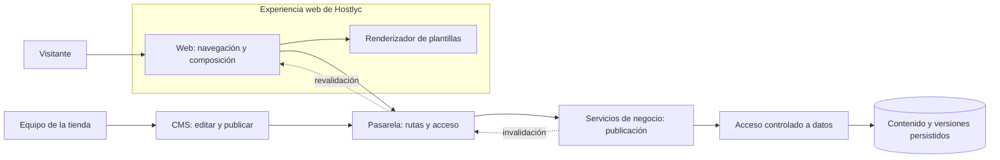

# Hostlyc: plantillas editables y publicación

Esta guía explica cómo Hostlyc combina presentación reutilizable y contenido de cada tienda.
Se basa en las guías de arquitectura pública del estado revisado el **29 de septiembre de 2026**.
Es evidencia documental para el portafolio; no constituye una nueva auditoría de código ni de producción.

## Contexto

Una plantilla define estructura y estilos; una tienda aporta textos, imágenes y datos publicados.
El CMS permite editar contenido y opciones de presentación previstas por un contrato.
La publicación valida esas piezas y produce una versión que puede consumir la experiencia pública.
Guardar un borrador y publicar son acciones distintas.

La web conserva la navegación y la identidad global de Hostlyc.
Un renderizador dentro de esa web compone el escaparate con componentes previamente desplegados.
El CMS no entrega HTML, CSS ni componentes arbitrarios al navegador.

## Componentes y responsabilidades

El diagrama es conceptual: las cajas describen responsabilidades, no infraestructura física.
El renderizador es un componente de la web, aunque se mantiene en un paquete separado.



Web y CMS pasan por la pasarela; no escriben directamente en la persistencia.
Los servicios de negocio conservan las decisiones de acceso y publicación.
El acceso a datos utiliza operaciones registradas y validadas.

## Contratos de publicación y renderizado

| Pieza | Responsabilidad | Comprobación relevante |
| --- | --- | --- |
| Familia de plantilla | Componentes y estilos reutilizables. | Solo las familias y modos soportados por el contrato actual. |
| Borrador | Contenido editable antes de su publicación. | No se presenta como contenido público por el hecho de guardarse. |
| Manifiesto | Familia, secciones, presentación, capacidades y versión. | Alcance de tienda y selección de renderizador permitida. |
| Hidratación | Valores publicados que llenan las secciones. | Misma tienda y versiones de contenido y plantilla esperadas. |
| Capacidades | Funciones o modos disponibles según el contrato de la tienda. | La selección visual no concede por sí sola una función. |
| Señal de invalidación | Informa que cambió contenido público. | Alcance permitido, entrega pendiente y reintentos. |

Manifiesto e hidratación deben corresponder entre sí antes de renderizar.
El identificador de plantilla no activa un parche particular de estilos en el sitio padre.
La presentación se obtiene de un contrato validado; si falta, se aplica una alternativa neutra.

## Secuencia de publicación

```mermaid
sequenceDiagram
  actor E as Editor
  participant C as CMS
  participant G as Pasarela
  participant A as Publicación
  participant D as Datos
  participant W as Web y renderizador
  E->>C: Edita contenido permitido
  C->>G: Guarda borrador
  G->>A: Solicitud autorizada
  A->>D: Persiste el borrador
  E->>C: Solicita publicar
  C->>G: Publica la versión esperada
  G->>A: Solicitud autorizada
  A->>A: Valida acceso, contrato y versión
  A->>D: Confirma contenido y versión publicados
  D-->>A: Publicación persistida
  A-->>G: Resultado y señal de invalidación
  G-->>C: Resultado de publicación
  G-->>W: Revalidar contenido público
  W->>G: Lee manifiesto e hidratación
  G->>A: Lectura permitida
  A->>D: Consulta versión publicada
  D-->>A: Datos y versiones
  A-->>G: Contratos publicados
  G-->>W: Manifiesto e hidratación
  W->>W: Comprueba tienda y versiones; renderiza
```

La secuencia muestra el camino principal y omite ramas de error para facilitar su lectura.
La invalidación también dispone de entrega pendiente y reintentos; no depende únicamente de esta respuesta inmediata.
La caché pública utiliza etiquetas de revalidación y validadores por alcance.
La persistencia sigue siendo la fuente de verdad, incluso si una entrega de invalidación se retrasa.

## Decisiones y sus implicaciones

Los patrones siguientes están descritos en las guías; sus beneficios y costos son análisis para explicar el diseño.
No representan nuevos ADR aprobados ni una atribución de autoría personal.

| Patrón documentado | Beneficio evaluado | Costo o límite evaluado |
| --- | --- | --- |
| Separar estructura y contenido versionado. | Reutilizar una familia entre tiendas y detectar combinaciones incoherentes. | Mantener compatibilidad entre contratos, contenido y componentes. |
| Mantener estilos de tienda en el paquete de renderizado. | Reducir reglas particulares dentro del sitio padre. | La separación del paquete no implica encapsulación absoluta de todo el CSS. |
| Limitar la edición a campos y capacidades permitidos. | Conservar una composición predecible y validable. | Una pantalla fuera del contrato necesita desarrollo adicional. |
| Publicar antes de invalidar vistas públicas. | Asociar la actualización visual con contenido persistido. | Los fallos de entrega requieren reintentos y seguimiento. |

## Estado y límites

- **Confirmado por las guías revisadas:** manifiesto e hidratación, comprobaciones de tienda y versiones, estilos de familias en un paquete separado y publicación autorizada.
- **Confirmado por las guías revisadas:** caché pública con revalidación, eventos de invalidación y entrega pendiente con reintentos.
- **Alcance:** cada familia admite los tipos de página y campos de su contrato actual; las capacidades varían por tienda.
- **Límite operativo:** la documentación no garantiza que toda integración esté activa en todos los entornos ni una actualización instantánea bajo fallo.
- **Demo del portafolio:** es una recreación ficticia con datos sanitizados. No conecta con estos servicios ni prueba publicación, permisos o invalidación reales.

## Evolución propuesta

- Añadir familias o tipos de página mediante contratos y componentes del renderizador.
- Explorar una vista previa que muestre borrador y versión publicada antes de confirmar cambios.
- Explorar comparaciones de versiones para comunicar al editor qué contenido se publicará.

Estas ideas son propuestas; no se presentan como funciones entregadas.

## Fuentes documentales

- **Arquitectura pública de Hostlyc — README:** alcance y distinción entre implementación y dirección de diseño.
- **03 · Plantillas reutilizables, tiendas diferentes:** manifiesto, hidratación, estilos, capacidades y límites del CMS.
- **02 · Datos frescos sin multiplicar consultas:** fuente de verdad, caché pública, invalidación y reintentos.
- **01 · Hostlyc: un ecosistema, varias experiencias:** responsabilidades de web, pasarela, negocio y datos.
- **Mapa del ecosistema:** contraste documental del recorrido CMS → pasarela → servicios de negocio.

Las fuentes describen el estado revisado el **29-09-2026**. Aquí se omiten configuración, identificadores y procedimientos internos.
